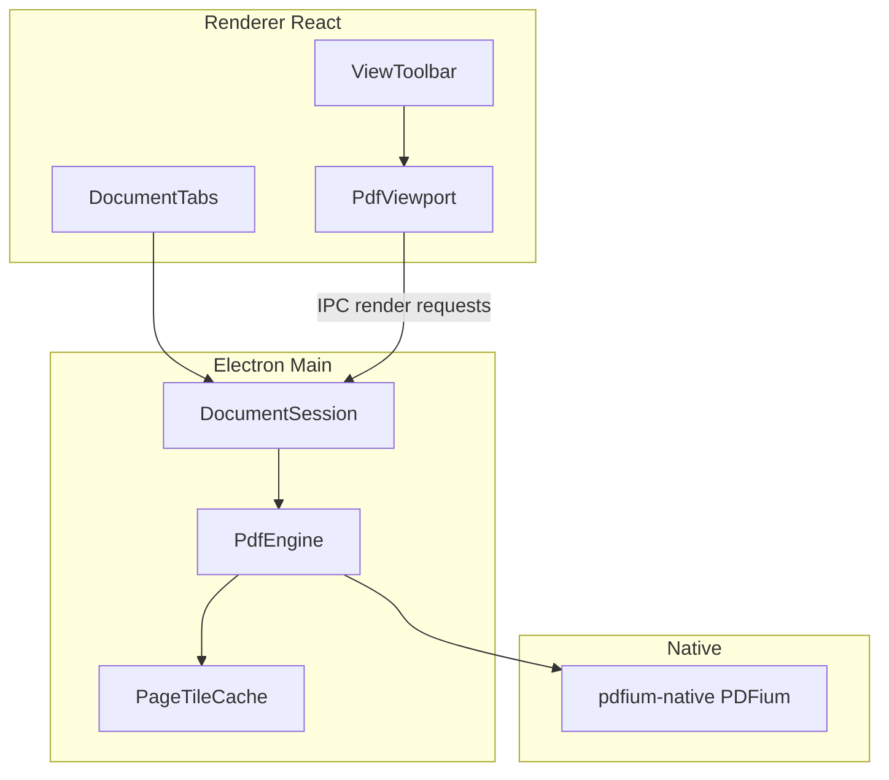

# MarkStratum: Overall Architecture and Roadmap

Living plan for further development. The viewer MVP described here is implemented; later phases are the product path toward a Bluebeam-like markup and editing app.

Repository: https://github.com/nicholasjamesboyd/MarkStratumPDF

## Decisions locked in

- **Shell:** Electron + TypeScript
- **PDF engine:** PDFium via [`pdfium-native`](https://github.com/xonaman/nodejs-pdfium-native) (MIT, N-API, prebuilds for Windows/macOS/Linux)
- **UI:** React + Vite in the renderer
- **Platforms:** Windows, macOS, Linux (`electron-builder`)
- **License:** MIT; no proprietary SDKs; no LLM dependencies
- **Compatibility:** prefer writing real PDF objects/annotations PDFium can persist, not a proprietary sidecar format

PDFium stays behind a local `PdfEngine` interface so rendering can later move to a custom N-API addon (tile/windowed renders) or even a native core without rewriting the UI.

## Target product shape



## Long-term feature phases

1. **Multi-doc shell:** tabs, thumbnails, drag-drop open across documents
2. **Markups:** highlight, pen, shapes, text; write standard PDF annotations for compatibility
3. **Measure and stamp:** calibrated scale, length/area, stamp library
4. **Page ops:** reorder, extract, insert, combine, drag pages between docs
5. **Flatten / forms / layers:** annotation flatten, AcroForm fill, OCG layer visibility
6. **OCR / rewrite:** Tesseract (Apache-2.0) for text layer; content object edit later

## Viewer MVP (completed)

### In scope (done)

- Open one local PDF (file dialog, OS open-with, drag onto window)
- Page count, go-to page, fit-width / fit-page / zoom percent
- Two navigation modes:
  - **Document:** vertical continuous scroll
  - **Drawing:** pan/drag canvas, scroll-wheel zoom toward cursor
- Visible-page rendering via PDFium in the main process
- LRU bitmap cache keyed by `pageIndex + scale + rotation`
- Password prompt for encrypted PDFs
- Window chrome: menu (File/Open, View modes, Zoom), toolbar, status bar
- Cross-platform packaging scripts and GitHub Actions CI
- MIT `LICENSE`, README, third-party notices

### Out of MVP (still planned above)

- Tabs, markups, measure, stamps, edit/combine, flatten, forms, OCR, layers, cloud/sync

### Known MVP follow-ups (before or alongside phase 1)

- Per-page size probing (open currently reuses first-page size as placeholders for later pages)
- True tiled / windowed rendering for huge sheets (`renderRegion` on `PdfEngine`)
- Keep packaging of `pdfium-native` `build/Release` binaries stable (`electron-builder` `files` + `asarUnpack`)
- Stronger cancel/stale-render handling under rapid zoom
- Optional: rename local workspace folder to match `MarkStratumPDF`

## Current repo layout

```text
MarkStratumPDF/
  LICENSE
  README.md
  NOTICE.md
  docs/
    ROADMAP.md              # this file
  package.json
  electron-builder.json
  vite.config.ts
  electron/
    main/
      index.ts              # app lifecycle, menus, IPC
      menu.ts
      pdf/
        pdfEngine.ts        # PdfEngine interface + pdfium-native adapter
        pageCache.ts        # LRU rendered-page cache
        documentSession.ts  # open/close, page meta, render jobs
    preload/
      index.ts              # window.markStratum bridge
  src/
    App.tsx
    components/
      PdfViewport.tsx
      Toolbar.tsx
      StatusBar.tsx
      PasswordDialog.tsx
    hooks/
      useDocumentSession.ts
    styles/
      app.css
  shared/
    ipc.ts
  scripts/
    ensure-pdfium.mjs
  .github/workflows/
    ci.yml
    build.yml
```

## Technical design (foundation to keep)

### PdfEngine boundary

```ts
interface PdfEngine {
  open(path: string, password?: string): Promise<PdfDocumentHandle>
  getPageCount(doc: PdfDocumentHandle): number
  getPageSize(doc: PdfDocumentHandle, pageIndex: number): Promise<SizePts>
  getPages(doc: PdfDocumentHandle): Promise<PageInfo[]>
  renderPage(doc: PdfDocumentHandle, req: EngineRenderRequest): Promise<EngineRenderedPage>
  close(doc: PdfDocumentHandle): Promise<void>
}
```

MVP renders whole pages at the active scale (capped max pixel dimension to avoid PDFium ~2GB bitmap limits). Later add `renderRegion` for true tiles on huge sheets.

### Process model

- **Main:** owns PDFium, file I/O, cache, render queue (limit concurrency to CPU count)
- **Preload:** expose a narrow `window.markStratum` API
- **Renderer:** viewport only; requests pages for the visible range; never loads native PDFium

Rendered page payloads cross IPC as base64 JPEG for reliable cloning through the context bridge.

### Viewport behavior

- Continuous vertical strip of page placeholders sized from PDF page points
- Scroll metrics request nearby pages (`n-1..n+1` minimum)
- Drawing mode: CSS transform pan/zoom on a stage; wheel changes scale and re-renders around cursor
- Ignore stale renders when the open document path changes

### Packaging and CI

- `electron-builder` targets: NSIS/portable (Windows), dmg (macOS), AppImage + deb (Linux)
- Explicitly include `pdfium-native` Release binaries (`*.node`, `*.dll`, `*.dylib`, `*.so`) and unpack them from asar
- `npmRebuild: false` (N-API prebuilds; avoid node-gyp on machines without a C++ toolchain)
- GitHub Actions: typecheck/tests on push/PR; tagged builds on `v*` for win/mac/linux

## Suggested next implementation order

1. Multi-document tabs + thumbnail strip
2. Annotation model backed by PDF annotation objects (read first, then create/edit)
3. Markup tools (highlight, pen, rectangle, text)
4. Save / Save As preserving annotations
5. Measure + stamp
6. Page assemble/extract/combine
7. Flatten, forms, layers
8. OCR (Tesseract) and content rewrite

## Success criteria (product)

- Open large multi-page and large-sheet PDFs without loading every page bitmap into memory
- Smooth Document vs Drawing navigation
- Markup and page ops round-trip cleanly in other PDF viewers
- MIT-compatible dependency tree only
